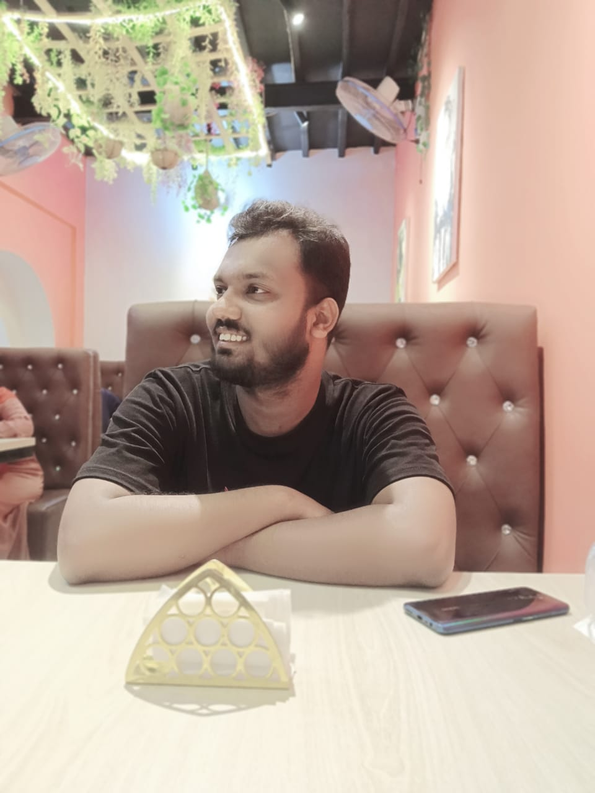

# Shahin Ali - Full Stack Developer Portfolio



A modern, responsive portfolio website showcasing my skills, projects, and experience as a Full Stack Developer. Built with modern web technologies and featuring an elegant, interactive design with dark/light mode support.

## 🌟 Features

- **Responsive Design**: Fully responsive layout that works seamlessly across all devices
- **Dark/Light Mode**: Dynamic theme switching with smooth transitions
- **Interactive UI Elements**: 
  - Animated skill orbit with technology icons
  - Smooth scrolling animations
  - Hover effects and transitions
  - Glass-morphism design elements

## 🛠 Tech Stack

### Frontend
- HTML5
- Tailwind CSS (with custom animations and utilities)
- JavaScript (Vanilla JS for interactions)
- Font Awesome Icons

### Key Features & Sections

#### 🏠 Hero Section
- Modern gradient background
- Professional introduction
- Smooth scroll indicator

#### 👨‍💻 About Section
- Professional profile
- Core tech stack
- Development philosophy
- Real-time applications showcase

#### 💼 Experience Section
- Current role details
- Professional achievements
- Technology expertise

#### 🎯 Skills Section
- Interactive rotating technology orbit
- Categorized skill display:
  - Frontend Development
  - Backend Development
  - API & Integration
  - Database & Caching
  - DevOps & Cloud
  - Tools & Others

#### 🚀 Projects Section
- Featured projects showcase
- Project descriptions and technologies used
- Live demo and code links

## 📁 Project Structure

```
├── index.html
├── assets/
│   ├── favicon/
│   ├── icons/
│   └── images/
├── css/
│   ├── input.css
│   └── output.css
└── js/
    ├── cursor.js
    ├── form.js
    ├── index.js
    ├── loading.js
    ├── mobile-menu.js
    ├── navbar.js
    ├── parallax.js
    ├── preload.js
    ├── quick-reply.js
    ├── scroll-reveal.js
    ├── skills.js
    └── theme.js
```

## 🎨 Design Features

- **Glass-morphism Effects**: Modern, translucent UI elements
- **Gradient Backgrounds**: Subtle, professional color schemes
- **Animated Elements**: 
  - Floating animations
  - Pulse effects
  - Rotating skill orbit
  - Scroll reveal animations
- **Interactive Components**:
  - Hoverable skill cards
  - Responsive navigation
  - Smooth transitions

## 💻 Technologies & Tools

- **Frontend**: 
  - React.js
  - Next.js
  - JavaScript
  - TypeScript
  - Tailwind CSS
  - Redux

- **Backend**: 
  - Node.js
  - Express.js
  - NestJS
  - Socket.IO

- **Databases**: 
  - MongoDB
  - PostgreSQL
  - Redis
  - Prisma ORM

- **DevOps & Tools**: 
  - Docker
  - Git
  - VS Code
  - Postman

## 🚀 Getting Started

1. Clone the repository:
```bash
git clone https://github.com/shahinali-dev/shahin-ali.git
```

2. Open the project in your preferred code editor

3. If you're using VS Code with Live Server:
   - Install Live Server extension
   - Right click on index.html
   - Select "Open with Live Server"

4. For development with Tailwind CSS:
```bash
# Install dependencies
npm install

# Start Tailwind CLI build process
npm run dev
```

## 📱 Responsive Design

The portfolio is fully responsive and optimized for:
- Desktop screens (1024px and above)
- Tablets (768px to 1023px)
- Mobile devices (320px to 767px)

## 🌗 Theme Support

- Supports both light and dark modes
- Automatically detects system preference
- Manual theme toggle option
- Smooth transition between themes

## 🔍 SEO & Accessibility

- Semantic HTML structure
- ARIA labels and roles
- Alt text for images
- Meta tags for SEO
- Keyboard navigation support

## 🤝 Contributing

Feel free to fork this project and customize it for your own use. If you find any bugs or have suggestions for improvements, please open an issue or submit a pull request.

## 📄 License

This project is open source and available under the [MIT License](LICENSE).

## 📞 Contact

- Website: [Your Website URL]
- GitHub: [@shahinali-dev](https://github.com/shahinali-dev)
- LinkedIn: [Shahin Ali](www.linkedin.com/in/shahinali-dev)
- Email: [shahinali.dev@gmail.com]

---

Built with 💻 by Shahin Ali
